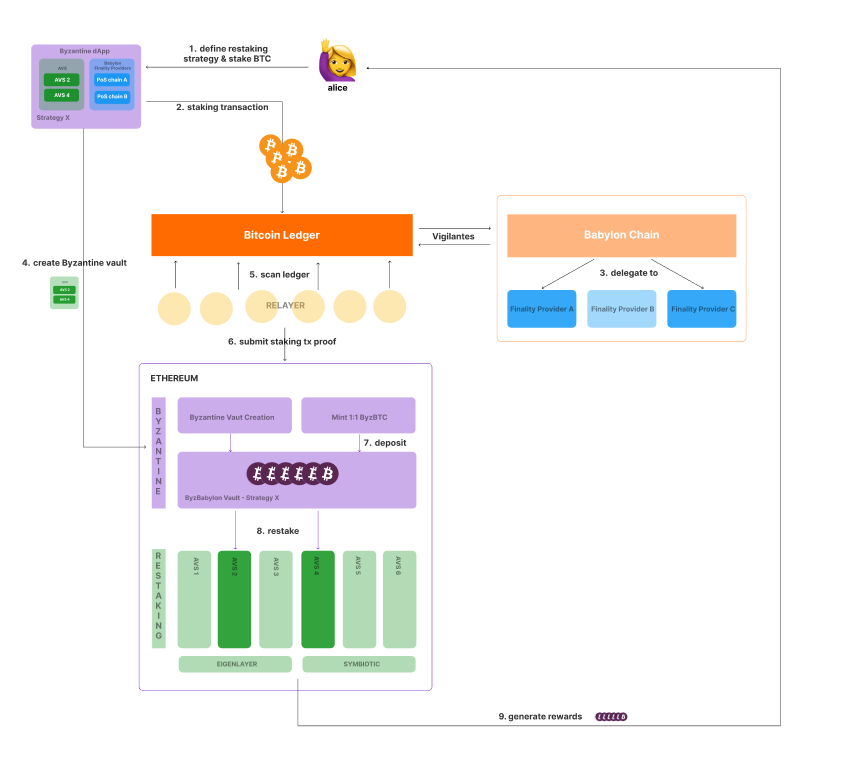

# BaByzantine - Babylon self-custodial cross-chain restaking

*This repository gathers all the code created from scratch for the **BabylonLabs Hackathon in November 2024**.*

---

## Welcome to Byzantine Finance 🌐

> The first aggregation layer for restaking

### What We Offer

Build custom restaking strategies across:
  - Any chains
  - Any protocols
  - Any collateral assets

### Key Features

✨ **Effortless Vault Creation**  
🔧 **Flexible Risk Adjustment**  
📈 **DeFi Leverage for Optimal Returns**  
🌉 **Cross-Chain Restaking Support**  

## 🚀 Try BaByzantine Now!

Visit our dApp at [babylon-byz.vercel.app](https://babylon-byz.vercel.app) to:
- Create your custom Babylon cross-chain restaking vault
- Manage your cross-chain assets
- Optimize your staking returns

> Experience the future of restaking today!

For all the details about the project, visit our page on DoraHacks: [https://dorahacks.io/buidl/19084](https://dorahacks.io/buidl/19084).

## Repository Structure

This GitHub repository is split into several submodules:

-  [babylon-evm](https://github.com/linnnnnnh/babylon-evm/tree/dd0a7fd0d07dbaf999083d076b34412ebd012a1c)  
*Ethereum contracts for the mint and the restaking of BTC LST on Symbiotic.*  
This module contains the smart contracts deployed on the Ethereum Virtual Machine (EVM) to handle the restaking of Bitcoin on the Symbiotic network.

-  [bitcoin-staking-relayer](https://github.com/linnnnnnh/bitcoin-staking-relayer)  
*Bitcoin chain monitoring and proof generation for staking transactions.*  
This module continuously monitors the Bitcoin blockchain for new staking transactions, generates Merkle proofs for these transactions, and verifies them using SPV (Simplified Payment Verification). It acts as a crucial bridge between Bitcoin staking activities and their verification on Ethereum.

-  [babylon-byz](https://github.com/Benoitded/babylon-byz)  
*Frontend interface of the project.*  
Everything visible on [https://babylon-byz.vercel.app/](https://babylon-byz.vercel.app/) is developed in this module. It includes the user interface for interacting with Byzantine Finance's features. The Staking Script transaction is done by using the Babylon [btc-staking-ts](https://github.com/babylonlabs-io/btc-staking-ts) sdk.

- [spv](https://github.com/catalogfi/spv/tree/ac28c94929d250f95b170705dd13ab3b33e89c3d)  
*Simplified Payment Verification to verify Bitcoin staking transactions on Ethereum.*
This component implements SPV to allow Ethereum smart contracts to verify Bitcoin staking transactions securely.  
> Note: The SPV module is written and maintained by [Catalog Finance](https://www.catalog.fi/).

## BaByzantine Architecture

Our architecture is designed to enable seamless cross-chain restaking operations on Babylon and Symbiotic / EigenLayer:

This architecture ensures the restaking of BTC on Babylon and Symbiotic / EigenLayer, the secure mint of a Babylon LST token (proved by SPV), while maintaining decentralization and trustlessness.

---

*Byzantine Finance is pioneering the future of cross-chain restaking. Join us on this exciting journey!*
